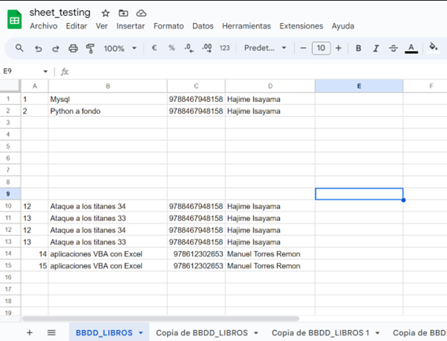

# Api GoogleSheets for VBA


Crea, lee, actualiza y elemina los datos de tus GoogleSheets a través de [Google Sheets API](https://console.cloud.google.com/marketplace/product/google/sheets.googleapis.com?q=search&referrer=search&project=total-messenger-353018) usando VBA.

Se han creado las clases necesarias para consumir esta API, aun hay mucho por desarrollar pero eh tratado de abarcar lo necesario para poder hacer CRUD con las GoogleSheets.

Sí quieres contribuir haz un fork del proyecto y envia un PR para discutirlo.

## Tabla de contenido

1. [Instalación](#instalación)
2. [Activar referencias](#activar-referencias)
3. [Configuración de entorno en Google](#configuración-de-entorno-en-google)
4. [Guardar credenciales de acceso](#guardar-credenciales-de-acceso)
5. [Ejemplos de uso](#ejemplos-de-uso)
6. [Recursos adicionales]()

## Instalación

Puedes hacerlo de cualquiera de las 2 formas:

Sí cuentas con [git](https://git-scm.com/) :

```sh
git clone https://github.com/888Leonidas888/Api-GoogleSheets_for_VBA.git
```

O también puedes descargar este repositorio de forma manual, haz lo siguiente:

1. Presiona en el botón de color verde  en la parte superior derecha.
2. Selecciona la opción **Download ZIP** para comenzar la descarga.
3. Por último descomprime el repositorio que acabas de descargar.

## Activar referencias

Antes de hacer uso, debes asegurarte de tener activadas las siguientes referencias, una vez abierto el archivo te saltará una advertencia pidiendo que actives las macros, acepta para continuar, una vez habilitada las macros presiona `Alt` + `F11` para ir al VBE, en la barra de menú seleciona **Herramientas** -> **Referencias** y procede activar las siguientes referencias:

1. Visual Basic For Applications
2. Microsoft Access 16.0 Object Library
3. OLE Automation
4. Microsoft Office 16.0 Access database engine Object Library
5. Microsoft Excel 16.0 Object Library
6. Microsoft Scripting Runtime
7. Microsoft XML, v6.0

> [!NOTE]
> Aparte de las referencias mencionadas arriba, también se debe contar con el siguiente módulo [JsonConverter.bas v2.3.1](https://github.com/VBA-tools/VBA-JSON/tree/master), este módulo es imprescindible para poder manipular las respuestas que se reciban por parte de la API, no te preocupes por importarlo los archivos ya estan equipados con dicho módulo.

## Configuración de entorno en Google

Posiblemente este sea uno de los pasos mas tediosos a seguir pero tomese su tiempo para leerlo detenidamente, pronto agregaré un videotutorial de como hacerlo, pero por ahora siga los pasos en los enlaces o visite [Desarrolla en Google Workspace](https://developers.google.com/workspace/guides/get-started?hl=es_419).

1. [Crea un proyecto de Google Cloud](https://developers.google.com/workspace/guides/create-project?hl=es-419)
2. [Habilita las APIs que deseas usar](https://developers.google.com/workspace/guides/enable-apis?hl=es-419)
3. [Obtén información sobre cómo funcionan la autenticación y autorización](https://developers.google.com/workspace/guides/auth-overview?hl=es-419)
4. [Configura el consentimiento de OAuth](https://developers.google.com/workspace/guides/configure-oauth-consent?hl=es-419)
5. [Crea credenciales de acceso](https://developers.google.com/workspace/guides/create-credentials?hl=es-419)

## Guardar credenciales de acceso

[Las credenciales de acceso](https://developers.google.com/workspace/guides/create-credentials?hl=es-419#api-key) obtenidas debes guardarlas en el directorio **credentials** (no es obligatorio) con extensión **json**, al comienzo solo tendrás 2 archivos; el primero para la [Clave API](https://developers.google.com/workspace/guides/create-credentials?hl=es-419#api-key) y el segundo [ID de cliente de OAuth](https://developers.google.com/workspace/guides/create-credentials?hl=es-419#oauth-client-id)

- **Clave de API:** Guardalo de la siguiente manera, esto es obligatorio, de lo contrario la instancia de `FlowOauth` no podrá encontrar este valor, nombra al archivo como mejor te convenga:

```json
{
  "your_api_key": "AIzaSiAsOpGUEW5oS_A6cPkMFLonxGy2uhtgv2j4"
}
```

- **ID de cliente de OAuth:** Solo descargamos y guardamos el archivo, nombra al archivo como mejor te convenga, tu archivo será algo como esto:

```json
{
  "web": {
    "client_id": "293831635874-8dfdmnbctsmfhsgfhg874.apps.googleusercontent.com",
    "project_id": "elegant-tangent-388222",
    "auth_uri": "https://accounts.google.com/o/oauth2/auth",
    "token_uri": "https://oauth2.googleapis.com/token",
    "auth_provider_x509_cert_url": "https://www.googleapis.com/oauth2/v1/certs",
    "client_secret": "GOCSPX-...",
    "redirect_uris": ["http://localhost:5500/"],
    "javascript_origins": ["http://localhost:5500"]
  }
}
```

- **Token de acceso:** En este apartado mencioné que solo serián dos archivos, hay un tercer archivo en formato json, este archivo será generado por la instancia de `FlowOauth` cuando lo invoques desde **VBA** al intentar acceder a tu **Google Sheets**. Solo debes asegurarte de pasarlo en el argumento `credentialsToken` la ruta de dicho archivo a la instancia de `FlowOauth`. Nombra al archivo como mejor te convenga.

> [!NOTE]
> En ningún caso será necesario crear el archivo con el **token de acceso** de forma manual, la instancia de `FlowOauth` se encargará de crearlo si no lo encuentra, actualizar el token si ha ya ha vencido si ha expirado.

## Ejemplos de uso

Bien, ya estamos listos!!!.

### Probando nuestra instancia de FlowOauth

Abre tu ventana inmediato en la barra de menú: **Ver** -> **Ventana inmediato** o control `Ctrl` + `G`, ejecuta el sgte código, esto generará el archivo con el **token de acceso**.

- La primera vez que ejecutes este código,sigue estos paso:

  1. Selecciona tu cuenta google.
  2. Luego se mostrará una ventana **Google no ha verificado esta aplicación**; selecciona la opción de **continuar**.
  3. Se te mostrará un ventana indicandote los permisos que estas otorgando para acceder a tus **Google Sheets**, selecciona la opción de **continuar**.
  4. La siguiente vista será un **No se puede encontrar esta página (localhost)**, debes ir a la barra de direcciones y copiar el valor que esta entre **code=** y **&scope** (la parte que esta sombreada) en el ejemplo mas abajo, tendrás un inputBox donde debes pergarlo y darle en **Aceptar**, con este último paso puedes revisar tu directorio **credentials** y observar que se ha generado un nuevo archivo con el **token de acceso**, ahora estamos listos para interactuar con nuestros **Google Sheets**.

     http://localhost/?code=`4/0AeaYSHB1bC-VDJp-PxOgYYLLdmGhEk6r-iKFl_Cj4HiF3iUL5k7ranwrMe18n4_OYmSNKa`&scope=https://www.googleapis.com/auth/spreadsheets

```vb
Public Const OU_SCOPE_SPREADSHEETS As String = "https://www.googleapis.com/auth/spreadsheets"

Sub init_FlowOauth()

    Dim credentialsClient As String
    Dim credentialsToken As String
    Dim credentialsApiKey As String
    Dim oFlowOauth As New FlowOauth

    credentialsClient = CurrentProject.Path + "\credentials\client_secret.json"
    credentialsToken = CurrentProject.Path + "\credentials\credentials_token.json"
    credentialsApiKey = CurrentProject.Path + "\credentials\api_key.json"

    oFlowOauth.InitializeFlow _
                            credentialsClient, _
                            credentialsToken, _
                            credentialsApiKey, _
                            OU_SCOPE_SPREADSHEETS

End Sub

```

Las siguientes líneas son las que verás en tu **ventana inmediato** excepto la última línea hasta que terminé de ejecutar el proceso:

```
Flujo de Oauth 2.0 19/03/2024 15:57:41  >>> flow started
Flujo de Oauth 2.0 19/03/2024 15:57:41  >>> FILE NOT FOUND C:\Users\JHONY\Desktop\Api-GoogleSheets_for_VBA\credentials\credentials_token.json
Flujo de Oauth 2.0 19/03/2024 16:04:22  >>> new token generated
```

### Consultando valores

Para este ejemplo previamente se ha creado un **Google Sheets**, el `id` es la cadena de caracteres mas larga que veas en la barra de direcciones, la siguiente imagen es de referencia:



```vb
Sub get__SpreadSheetValue()

    Dim credentialsClient As String, credentialsToken As String, credentialsApiKey As String
    Dim oFlowOauth As New FlowOauth
    Dim SpreadSG As New SpreadSheetValue
    Dim responseJSON As String
    Dim arrValue() As Variant
    Dim strValue As String
    Dim id As String
    Dim range As String

    credentialsClient = CurrentProject.Path + "\credentials\client_secret.json"
    credentialsToken = CurrentProject.Path + "\credentials\credentials_token.json"
    credentialsApiKey = CurrentProject.Path + "\credentials\api_key.json"

    id = "1FC3AXegBhMeDWtjE-cPnVWlZAENLkOjXTueMWye7L4w"
    range = "bbdd_libros"

    Rem comienza de el flujo de Oauth (autenticación y autorización)
    oFlowOauth.InitializeFlow _
                               credentialsClient, _
                               credentialsToken, _
                               credentialsApiKey, _
                               OU_SCOPE_SPREADSHEETS

    Rem realizamos la consulta con GoogleSheets
    With SpreadSG
        .ConnectionService oFlowOauth
         responseJSON = .GetValue(id, range)
    End With

    If SpreadSG.Operation = GO_SUCCESSFUL Then
        Rem leemos la respuesta
        arrValue = ProcessResponse.GetValue(responseJSON)

        For i = LBound(arrValue, 1) To UBound(arrValue, 1)
            strValue = Empty
            For o = LBound(arrValue, 2) To UBound(arrValue, 2)
        Rem la estructura condicional solo es para obtener una
        Rem mejor vista de los datos puede obviarse junto con la función ConsoleShow()
                If o = 0 Then
                    strValue = strValue & ConsoleShow(arrValue(i, o), 4)
                Else
                    strValue = strValue & ConsoleShow(arrValue(i, o), 25)
                End If
            Next o
            Debug.Print strValue
        Next i
    Else
        Debug.Print SpreadSG.DetailsError
    End If

End Sub
```

En la **ventana inmediato** tendremos una salida como esta:

```
Flujo de Oauth 2.0 19/03/2024 16:57:43  >>> flow started
Flujo de Oauth 2.0 19/03/2024 16:57:43  >>> token verifying
Flujo de Oauth 2.0 19/03/2024 16:57:43  >>> using token_access
|   1|                    Mysql|            9788467948158|           Hajime Isayama
|   2|           Python a fondo|            9788467948158|           Hajime Isayama
|    |                         |                         |
|    |                         |                         |
|    |                         |                         |
|    |                         |                         |
|    |                         |                         |
|    |                         |                         |
|    |                         |                         |
|  12|  Ataque a los titanes 34|            9788467948158|           Hajime Isayama
|  13|  Ataque a los titanes 33|            9788467948158|           Hajime Isayama
|  12|  Ataque a los titanes 34|            9788467948158|           Hajime Isayama
|  13|  Ataque a los titanes 33|            9788467948158|           Hajime Isayama
|  14|aplicaciones VBA con Exce|             978612302653|      Manuel Torres Remon
|  15|aplicaciones VBA con Exce|             978612302653|      Manuel Torres Remon

```

### Agregando valores

```vb
Sub update__SpreadSheetValue()

    Dim credentialsClient As String, credentialsToken As String, credentialsApiKey As String
    Dim oFlowOauth As New FlowOauth
    Dim SpreadSG As New SpreadSheetValue
    Dim json As String
    Dim updateRangeValue As New Collection
    Dim id As String
    Dim range As String

    credentialsClient = CurrentProject.Path + "\credentials\client_secret.json"
    credentialsToken = CurrentProject.Path + "\credentials\credentials_token.json"
    credentialsApiKey = CurrentProject.Path + "\credentials\api_key.json"

    id = "1FC3AXegBhMeDWtjE-cPnVWlZAENLkOjXTueMWye7L4w"
    range = "BBDD_LIBROS!a16:d18"

    updateRangeValue.Add "45|Rimas y leyendas|9789583003103|Gustavo Adolfo Bécquer"
    updateRangeValue.Add "85|Estudio Escarlata|9786075562261|Arhur Conan Doyle"
    updateRangeValue.Add "CANTIDAD DE DATOS|=COUNTA(A1:A15)"
'    updateRangeValue.Add "=QUERY(BBDD_LIBROS!A1:E;\""SELECT *\"";1)"

    oFlowOauth.InitializeFlow _
                                 credentialsClient, _
                                 credentialsToken, _
                                 credentialsApiKey, _
                                 OU_SCOPE_SPREADSHEETS

    With SpreadSG
        .ConnectionService oFlowOauth
         json = .Update(id, range, updateRangeValue)
    End With

    If SpreadSG.Operation = GO_SUCCESSFUL Then
        Debug.Print ProcessResponse.UpdateValue(json)
    Else
        Debug.Print SpreadSG.DetailsError()
    End If

End Sub

```

Imagen de referencia después de la actualización:


Vea mas ejemplos en el módulo [Main](./src/Main.bas).

## Recursos adicionales

- [Google Sheets API](https://console.cloud.google.com/marketplace/product/google/sheets.googleapis.com?q=search&referrer=search&project=elegant-tangent-388222)
- [Micro lenguaje SQL para Google Sheets](https://developers.google.com/chart/interactive/docs/querylanguage)
- [Interfaces en VBA](https://stackoverflow.com/questions/3669270/vba-inheritance-analog-of-super)
